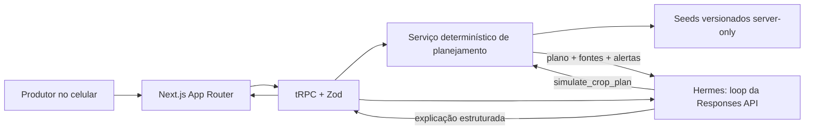

# Arquitetura regional, contrato do Hermes e limites legais do MVP

Pesquisa para os tickets **Desenhar arquitetura do SaaS regional**, **Definir contrato do agente Hermes** e **Definir segurança, LGPD e responsabilidades agronômicas**. Verificado em 19 de agosto de 2026.

> Este documento propõe uma arquitetura e controles de produto; não substitui parecer jurídico nem validação do CREA-SP. Antes de operar como serviço técnico agronômico, a equipe deve validar o enquadramento com advogado e profissional habilitado.

## Resumo executivo

O melhor corte para o hackathon é um **monólito Next.js/T3**: interface, seeds regionais, regras, cálculos e integração OpenAI ficam no mesmo deploy. Autenticação e banco já presentes ficam disponíveis para o primeiro incremento persistente. “Hermes” é um módulo server-side dentro do Next.js, não um microsserviço nem uma segunda base de dados.

O **SaaS é a fonte de verdade**. Ele valida entradas, calcula calendário/investimento/cenários e decide quais citações e alertas aparecem. No hackathon o rascunho não é persistido e o **Hermes somente conduz a conversa**, identifica campos faltantes, chama `simulate_crop_plan` e explica o resultado já calculado. No primeiro incremento do SaaS, Next.js passa a guardar usuário, plano, premissas, fontes e auditoria sob autorização; o Hermes continua sem acesso direto às tabelas.

Para o MVP, não usar File Search, vector store, Agents SDK, MCP, fila, microsserviço, RLS nem integrações meteorológicas/mercadológicas ao vivo. Três culturas e a localidade fixa de Jundiapeba cabem em dados-semente server-only versionados no repositório. Isso reduz código, custo, retenção externa e superfície de prompt injection. Postgres e File Search passam a fazer sentido, respectivamente, quando houver planos consentidos para salvar e quando a curadoria manual de documentos deixar de caber numa tabela de fatos e fontes.

## Ponto de partida verificado

O repositório já contém Next.js 15/App Router, React 19, tRPC 11, Zod, Better Auth, Drizzle ORM e Postgres ([`package.json`](../../package.json)). A sessão autenticada já entra no contexto tRPC e existe uma `protectedProcedure` ([`src/server/api/trpc.ts`](../../src/server/api/trpc.ts)); Better Auth já usa Drizzle/Postgres ([`src/server/better-auth/config.ts`](../../src/server/better-auth/config.ts)). O schema atual contém apenas autenticação e o exemplo `post` ([`src/server/db/schema.ts`](../../src/server/db/schema.ts)).

O vocabulário do produto já fixa Jundiapeba como demonstração, Mogi das Cruzes como região-piloto, alface/repolho/couve como culturas da demo e dois modos — explorar o talhão e avaliar uma cultura — com localidade, área, data, irrigação e canal de venda ([`CONTEXT.md`](../../CONTEXT.md)).

Consequência: não há legado de domínio para migrar e também não há motivo para introduzir outra camada de transporte ou persistência. O caminho curto é adicionar routers/serviços ao padrão existente.

## Arquitetura recomendada



### O que fica no Next.js/SaaS

| Responsabilidade        | Decisão para o MVP                                                                                                                                      |
| ----------------------- | ------------------------------------------------------------------------------------------------------------------------------------------------------- |
| Identidade e sessão     | Não exigidas na demo sem persistência; ao habilitar salvar, Better Auth existente e toda consulta privada usa `protectedProcedure`.                     |
| Autorização             | Ao habilitar planos salvos, `userId` vem da sessão, nunca de argumentos do modelo; toda leitura filtra `plan.userId = session.user.id`.                 |
| Estado da jornada       | Rascunho estruturado no browser durante a demo; no primeiro incremento persistente, Postgres guarda somente o plano explicitamente salvo.               |
| Conhecimento regional   | Fatos curados e versionados para Jundiapeba/Mogi, três culturas, calendário, cuidados e riscos; cada fato aponta para uma `source`.                     |
| Regras e cálculos       | Ranqueamento de culturas, datas do ciclo, quantidades, custo, produtividade e receita em funções TypeScript puras e testáveis.                          |
| Mercado                 | Observações de preço com cultura, unidade, qualidade, canal, origem, data e fonte; o serviço normaliza unidades e produz faixa, nunca “preço previsto”. |
| Citações                | O backend resolve `sourceId` em título, órgão, URL, data e trecho. IDs inventados pelo modelo são descartados.                                          |
| Persistência            | Fora da demo; no primeiro incremento: planos salvos, premissas, linhas de custo, fontes e versão das regras.                                            |
| Consentimento e memória | Fora da demo sem memória; no primeiro incremento: eventos versionados e preferências opcionais. Transcript bruto não é memória.                         |
| Auditoria               | Telemetria sanitizada de modelo, prompt/regras, tool, fontes, tokens, latência e erro; sem guardar a mensagem livre.                                    |
| Guardrails              | Validação, autorização, limites de domínio, bloqueio de prescrição, checagem de citações e rotulagem de incerteza.                                      |

### O que fica no Hermes

| Responsabilidade      | Limite                                                                                                 |
| --------------------- | ------------------------------------------------------------------------------------------------------ |
| Conversa              | Entender intenção, pedir somente os campos faltantes e usar linguagem curta em português.              |
| Orquestração          | Chamar `simulate_crop_plan` no hackathon; `load_plan` só existe depois de sessão e ownership.          |
| Explicação            | Transformar o retorno tipado em mensagem compreensível, mantendo premissas, intervalos e alertas.      |
| Recusa/encaminhamento | Recusar dose, mistura, marca ou receita de agrotóxico; sinalizar quando é necessária avaliação humana. |

Hermes **não** guarda memória própria, escreve no banco, escolhe uma base legal, autoriza usuário, cria fonte, busca preço/clima na internet, faz conta de custo/receita, altera uma recomendação técnica nem confirma um plano em nome do produtor.

## Modelo de dados mínimo

Não normalizar todo o domínio de propriedade/talhão/ciclo no dia do hackathon. O rascunho em sessão resolve a demo; um plano em JSONB versionado entra no primeiro incremento persistente, e a normalização completa só é útil quando houver edição independente, histórico de vários ciclos ou integrações.

Tabelas mínimas além das já existentes:

- `source`: `id`, título, emissor, URL, data de publicação/atualização, data de consulta e tipo.
- `knowledgeFact`: localidade, cultura opcional, categoria, conteúdo estruturado, vigência, confiança editorial e `sourceId`.
- `marketObservation`: cultura, canal, unidade, qualidade/embalagem, preço, data, origem/destino e `sourceId`.
- `costReference`: cultura, item, unidade, preço, data, região e `sourceId`.
- `plan`: `userId`, entradas, resultado JSONB, versão das regras, fontes e timestamps.
- `agentRun`: `userId`, `planId` opcional, modelo/prompt, tools, uso, latência, guardrail e erro sanitizado.
- `consentEvent`: `userId`, finalidade, ação (`granted`/`revoked`), versão do aviso e timestamp.

Índices necessários no MVP: `plan(userId, createdAt)`, `agentRun(userId, createdAt)` e filtros de conhecimento por `(localityId, cropId, category)`. Não criar repositórios genéricos, event sourcing ou abstração multi-região; `localityId = "jundiapeba-sp"` é um dado-semente explícito.

## Regras determinísticas

O modelo de linguagem não deve decidir os números. O serviço de planejamento produz:

1. **Elegibilidade e ranking**: regras versionadas avaliam janela de plantio, irrigação, ciclo, risco conhecido e canal. Cada parcela do score mantém `ruleId` e `sourceId`; ausência de evidência reduz a confiança em vez de ser preenchida pelo modelo.
2. **Calendário**: datas resultam da data de plantio mais offsets curados do ciclo e dos tratos. “Previsto” e intervalo aparecem na UI; o clima real pode deslocar datas.
3. **Investimento**: `quantidade × preço unitário` por insumo/serviço, somado por cenário. Toda quantidade, preço e data-base ficam editáveis e visíveis.
4. **Receita e margem**: para cada cenário, `produção comercializável × preço de referência`; margem bruta é `receita − investimento`. Não apresentar lucro líquido, garantia de produtividade ou previsão pontual.
5. **Proveniência**: cada cuidado, risco, custo e preço retorna uma ou mais fontes. Sem fonte válida, o campo vira “não disponível para este recorte”.

Um teste pequeno por função de cálculo e um cenário ponta a ponta (Jundiapeba, 1.000 m², alface) bastam para o corte do hackathon.

## Contrato pequeno do Hermes

A integração deve usar a **Responses API** no servidor. Function calling conecta o modelo a funções definidas pela aplicação por JSON Schema; a documentação oficial recomenda `strict: true`, que exige todos os campos como `required` e `additionalProperties: false` ([Function calling](https://developers.openai.com/api/docs/guides/function-calling)). Structured Outputs garante aderência ao schema, ao contrário do JSON mode ([Structured Outputs](https://developers.openai.com/api/docs/guides/structured-outputs)).

### Tool 1 — `simulate_crop_plan`

Uma única tool atende os dois modos. Em `explore`, `crop_id` é `null` e o resultado são até três candidatos. Depois da escolha, a mesma tool roda em `evaluate` e devolve o plano completo.

```json
{
  "name": "simulate_crop_plan",
  "description": "Calcula candidatos ou um plano regional usando apenas regras e dados do SaaS.",
  "strict": true,
  "parameters": {
    "type": "object",
    "additionalProperties": false,
    "properties": {
      "mode": { "type": "string", "enum": ["explore", "evaluate"] },
      "crop_id": { "type": ["string", "null"] },
      "locality_id": { "type": "string", "enum": ["jundiapeba-sp"] },
      "area_m2": { "type": "number", "exclusiveMinimum": 0, "maximum": 50000 },
      "planting_date": {
        "type": "string",
        "description": "Data ISO YYYY-MM-DD"
      },
      "irrigation": {
        "type": "string",
        "enum": ["unknown", "none", "manual", "sprinkler", "drip"]
      },
      "sales_channel": {
        "type": "string",
        "enum": [
          "unknown",
          "intermediary",
          "wholesale",
          "direct",
          "public_procurement"
        ]
      }
    },
    "required": [
      "mode",
      "crop_id",
      "locality_id",
      "area_m2",
      "planting_date",
      "irrigation",
      "sales_channel"
    ]
  }
}
```

Validações exclusivas do SaaS: `explore` exige `crop_id = null`; `evaluate` aceita apenas `lettuce`, `cabbage` ou `kale`; a data precisa existir no calendário; valores fora do público de até 5 ha são recusados como fora do MVP. O retorno contém `kind`, entradas normalizadas, candidatos ou plano, premissas, faixas, `calculation_version`, `source_ids`, `warnings` e `requires_human_review`; a tool não persiste nada.

### Primeiro incremento do SaaS — `load_plan`

```json
{
  "name": "load_plan",
  "description": "Carrega um plano pertencente ao usuário autenticado.",
  "strict": true,
  "parameters": {
    "type": "object",
    "additionalProperties": false,
    "properties": { "plan_id": { "type": "string" } },
    "required": ["plan_id"]
  }
}
```

O executor ignora qualquer identidade mencionada na conversa e usa a sessão do request. Um ID existente de outro usuário responde `not_found`, evitando enumeração.

### Sem tool de escrita

“Salvar plano” é uma mutation tRPC acionada por botão e confirmação explícita no SaaS. Ela recebe as entradas estruturadas e `calculation_version`, recalcula no servidor e então persiste. Não delegar essa decisão ao LLM elimina confirmação ambígua, chamadas duplicadas e escrita acidental.

### Saída final do modelo

Usar Structured Outputs com: `status` (`need_inputs`, `candidates`, `plan`, `handoff`), `message`, `missing_fields`, `plan_id`, `warnings` e `cited_source_ids`. O servidor intersecta `cited_source_ids` com as fontes efetivamente devolvidas pela tool e monta links/citações; o texto do modelo nunca é a autoridade de proveniência.

Configuração recomendada:

- `tool_choice: "auto"`; sem todos os campos, Hermes pergunta em vez de chamar a tool.
- `parallel_tool_calls: false`; a documentação permite desativar chamadas paralelas para garantir no máximo uma tool por turno, simplificando auditoria e idempotência ([Function calling](https://developers.openai.com/api/docs/guides/function-calling)).
- `store: false`; enviar a cada turno apenas o resumo estruturado mantido pelo SaaS.
- Timeout curto, no máximo uma repetição em erro transitório e teto de tokens por turno.

Prompt-base do Hermes: nunca responder fato agronômico ou preço com conhecimento do modelo; chamar a tool ou declarar indisponibilidade; diferenciar “relato do produtor”, “dado externo” e “cálculo”; nunca prometer rendimento/preço; nunca fornecer produto, dose, mistura, intervalo de aplicação ou receituário de agrotóxico; citar somente fontes fornecidas pela tool.

## OpenAI: escolhas, retenção e custo

### Escolha de modelo

Começar com `gpt-5.6-terra`: a OpenAI o posiciona como equilíbrio entre inteligência e custo, e o modelo suporta Responses, function calling e Structured Outputs ([página oficial do modelo](https://developers.openai.com/api/docs/models/gpt-5.6-terra)). Depois de uma avaliação com casos reais, `gpt-5.6-luna` é a opção de menor custo para alto volume e também suporta essas funções ([página oficial do modelo](https://developers.openai.com/api/docs/models/gpt-5.6-luna)). Não codificar o identificador na regra de negócio; usar uma variável de ambiente server-side.

Pelos preços oficiais verificados nesta data, Terra custa US$ 2/1M tokens de entrada e US$ 12/1M de saída; Luna, US$ 0,20/1M e US$ 1,20/1M ([pricing](https://developers.openai.com/api/docs/pricing)). Um envelope **assumido** de 8 mil tokens de entrada + 2 mil de saída custa cerca de US$ 0,04 em Terra ou US$ 0,004 em Luna por plano, antes de ferramentas. Isso é estimativa de planejamento, não cotação: medir `usage` em cada run e criar limite diário por usuário.

### Retenção e memória

Dados enviados à API não são usados para treinar modelos por padrão, salvo opt-in explícito. Logs de monitoramento de abuso podem conter prompts/respostas e, por padrão, ficam por até 30 dias. Objetos Response também são guardados por 30 dias por padrão, mas `store: false` desativa esse estado de aplicação; Zero Data Retention exige aprovação da OpenAI e não deve ser pressuposto ([Data controls](https://developers.openai.com/api/docs/guides/your-data), [Conversation state](https://developers.openai.com/api/docs/guides/conversation-state)).

Decisão do MVP: não usar Conversations API nem `previous_response_id`; o browser reenvia o estado estruturado necessário e nada do produtor é persistido. No primeiro incremento, Postgres guarda somente planos explicitamente salvos, preferências consentidas e auditoria sanitizada. Cada chamada usa `store: false`. Não guardar transcript livre por padrão.

### Por que não usar File Search agora

File Search exige arquivos carregados e um vector store, e pode devolver citações de arquivo ([File Search](https://developers.openai.com/api/docs/guides/tools-file-search)). Porém vector stores/files mantêm estado até serem excluídos e não são elegíveis a Zero Data Retention; o preço atual é US$ 0,10/GB/dia após 1 GB grátis mais US$ 2,50/1.000 chamadas ([Data controls](https://developers.openai.com/api/docs/guides/your-data), [pricing](https://developers.openai.com/api/docs/pricing)). Para três culturas e poucas fontes, seeds curados no repositório são mais simples, baratos, auditáveis e determinísticos.

Critério para adotar depois: a equipe tem dezenas de documentos atualizados com frequência e a extração manual virou gargalo. Mesmo então, documentos devem ser curados, classificados por local/cultura/data, ter política de exclusão e o resultado recuperado deve passar pelo serviço de domínio; nunca conceder ao Hermes acesso indiscriminado a arquivos do usuário.

## LGPD, consentimento e segurança

### Papéis e bases

A LGPD define controlador como quem decide finalidades/meios e operador como quem trata dados em nome do controlador; exige finalidade, adequação, necessidade, transparência, segurança e prestação de contas ([LGPD, arts. 5º e 6º](https://www.planalto.gov.br/ccivil_03/_ato2015-2018/2018/lei/l13709compilado.htm)). Para o desenho proposto, a entidade que opera o SaaS tende a ser controladora e a OpenAI um operador/suboperador contratado, mas o papel final depende dos contratos e do tratamento real.

Hipóteses recomendadas para análise jurídica — não usar “consentimento” como solução universal:

| Finalidade                                | Dados mínimos                                                            | Hipótese candidata                                                  | Decisão de produto                                                 |
| ----------------------------------------- | ------------------------------------------------------------------------ | ------------------------------------------------------------------- | ------------------------------------------------------------------ |
| Criar conta e entregar o plano solicitado | nome/email, localidade aproximada, área, cultura e preferências do plano | Execução de contrato/procedimentos a pedido do titular (art. 7º, V) | Aviso claro antes de enviar dados ao Hermes.                       |
| Guardar planos                            | entradas e resultados estruturados                                       | Execução do contrato                                                | Botão salvar; exportar/corrigir/excluir na conta.                  |
| Memória opcional entre planos             | preferências não necessárias, como canal habitual                        | Consentimento específico                                            | Opt-in separado, versionado e revogável; serviço funciona sem ele. |
| Segurança e auditoria                     | IDs, timestamps, eventos e IP somente quando necessário                  | Legítimo interesse e/ou obrigação aplicável, a validar              | Retenção curta, acesso restrito e sem texto bruto.                 |
| Marketing/contato futuro                  | telefone/email e preferência                                             | Consentimento separado                                              | Fora do MVP.                                                       |

Localização exata vinculada ao produtor pode identificá-lo. O MVP deve pedir apenas `jundiapeba-sp`, não coordenada, endereço rural, CPF ou documento. Fotos/áudio podem trazer rostos, voz, documentos e metadados; ficam fora do hackathon. Se entrarem depois, exigem finalidade, minimização e fluxo de exclusão próprios.

O consentimento, quando usado, deve ser livre, informado, inequívoco, específico, comprovável e revogável; autorizações genéricas são nulas ([LGPD, arts. 5º e 8º](https://www.planalto.gov.br/ccivil_03/_ato2015-2018/2018/lei/l13709compilado.htm)). Guardar `purpose`, `noticeVersion`, `grantedAt` e `revokedAt`, não apenas um booleano.

### Direitos e retenção

Oferecer confirmação de tratamento, acesso, correção e eliminação; a LGPD também prevê informação sobre compartilhamento, portabilidade e revogação. A resposta simplificada é imediata e a declaração completa tem prazo legal de até 15 dias ([LGPD, arts. 18 e 19](https://www.planalto.gov.br/ccivil_03/_ato2015-2018/2018/lei/l13709compilado.htm)).

Política mínima recomendada:

- conta/planos: enquanto a conta existir ou até pedido de exclusão, ressalvadas obrigações/exercício de direitos;
- rascunhos não salvos: ficam no browser e expiram com a sessão; não entram no banco;
- `agentRun`: 30 dias com dados estruturados e sanitizados;
- transcript livre: não persistir;
- consentimentos e incidentes: manter conforme finalidade e obrigação documentada; registros de incidentes com dados pessoais devem ser mantidos por pelo menos cinco anos segundo a ANPD ([Comunicação de incidente](https://www.gov.br/anpd/pt-br/canais_atendimento/agente-de-tratamento/comunicado-de-incidente-de-seguranca-cis)).

O controlador e o operador devem registrar as operações de tratamento, especialmente quando baseadas em legítimo interesse ([LGPD, art. 37](https://www.planalto.gov.br/ccivil_03/_ato2015-2018/2018/lei/l13709compilado.htm)). O inventário pode começar como uma tabela/documento simples com finalidade, dados, base, destinatários, retenção e salvaguardas.

### Transferência internacional

Enviar dados pessoais à OpenAI pode caracterizar transferência internacional dependendo do fluxo contratado. A Resolução ANPD 19/2024 exige finalidade/base legal e um mecanismo válido, como decisão de adequação, cláusulas-padrão, cláusulas específicas ou outra hipótese do art. 33; a transferência deve limitar-se ao mínimo necessário ([Resolução CD/ANPD nº 19/2024](https://www.gov.br/anpd/pt-br/acesso-a-informacao/institucional/atos-normativos/regulamentacoes_anpd/resolucao-cd-anpd-no-19-de-23-de-agosto-de-2024)). Antes da produção, revisar DPA/local de processamento e incorporar o mecanismo brasileiro aplicável; informar o compartilhamento e sua finalidade no aviso de privacidade.

### Controles mínimos de segurança

A LGPD exige medidas técnicas e administrativas desde a concepção do produto ([arts. 46 a 49](https://www.planalto.gov.br/ccivil_03/_ato2015-2018/2018/lei/l13709compilado.htm)). Para este MVP:

- chave OpenAI somente no servidor e validada pelo schema de ambiente; nunca `NEXT_PUBLIC_*`;
- procedures protegidas, verificação de propriedade em toda consulta/mutation e mensagens `not_found` uniformes;
- Zod na fronteira e validação de domínio dentro do serviço, inclusive data, área, enum e unidade;
- queries parametrizadas pelo Drizzle; sem SQL/model-generated code;
- segredo de produção forte, HTTPS, cookies seguros e rotação/revogação de credenciais;
- limite por usuário/IP, teto de tokens e orçamento mensal; falha fechada se o teto acabar;
- dados de fonte tratados como conteúdo não confiável, nunca como instrução de sistema;
- log sanitizado, sem chave, transcript, email ou detalhe rural desnecessário;
- backup e teste de restauração antes de piloto; processo documentado de exclusão/exportação;
- checklist oficial da ANPD para agentes de pequeno porte como baseline ([guia e checklist](https://www.gov.br/anpd/pt-br/centrais-de-conteudo/materiais-educativos-e-publicacoes/guia-orientativo-sobre-seguranca-da-informacao-para-agentes-de-tratamento-de-pequeno-porte)).

Incidente capaz de gerar risco/dano relevante deve ser comunicado pelo controlador à ANPD e aos titulares em até três dias úteis; o operador deve informar o controlador sem demora injustificada ([ANPD — Comunicação de incidente](https://www.gov.br/anpd/pt-br/canais_atendimento/agente-de-tratamento/comunicado-de-incidente-de-seguranca-cis)). Definir antes do piloto quem recebe o alerta, quem decide relevância e como revogar chaves/sessões.

## Responsabilidade agronômica e guardrails

A Lei 5.194/1966 reserva a profissionais habilitados atividades como planejamento da produção agropecuária, estudos, análises, pareceres e serviços técnicos; pessoa jurídica que execute atividade reservada precisa da participação efetiva e autoria declarada de profissional habilitado ([arts. 6º a 8º](https://www.planalto.gov.br/ccivil_03/leis/l5194.htm)). A Resolução Confea 218/1973 inclui, entre as atribuições do engenheiro agrônomo, orientação técnica, planejamento, estudo de viabilidade técnico-econômica e consultoria em fitotecnia, agrometeorologia, fertilizantes, uso do solo, processos de cultura e economia rural ([Resolução nº 218/1973](https://normativos.confea.org.br/Ementas/Visualizar?id=266)).

Todo contrato de prestação de serviço profissional de Agronomia fica sujeito a ART, que identifica o responsável técnico; o Confea orienta registrá-la antes da atividade ([Lei 6.496/1977](https://www.planalto.gov.br/ccivil_03/leis/l6496.htm), [Confea — ART](https://www.confea.org.br/servicos-prestados/anotacao-de-responsabilidade-tecnica-art)). Logo, um disclaimer sozinho não transforma consultoria personalizada em conteúdo educativo. Antes de comercializar planos individualizados como orientação técnica, validar com CREA-SP: registro da empresa, profissional efetivamente participante, escopo de ART e revisão/aprovação dos conteúdos.

A Lei 14.785/2023 exige receita agronômica emitida por profissional legalmente habilitado para comercialização direta de agrotóxicos ao usuário e atribui responsabilidade ao profissional por receita errada, imperícia, imprudência ou negligência ([arts. 39 e 50](https://planalto.gov.br/ccivil_03/_ato2023-2026/2023/lei/l14785.htm)). Portanto, o MVP:

- pode explicar manejo preventivo genérico, higiene, monitoramento e o dever de procurar assistência técnica, com fonte;
- não nomeia agrotóxico, ingrediente ativo ou mistura; não fornece dose, frequência, carência, equipamento ou receita;
- não diagnostica praga/doença a partir de texto/foto;
- não chama a saída de “laudo”, “parecer técnico”, “receita” ou “recomendação agronômica profissional”;
- marca custos, preços e produtividade como referências editáveis, datadas e incertas;
- mostra “apoio informativo para planejamento — valide decisões de manejo com profissional habilitado”; e
- retorna `requires_human_review = true` para defensivos, sintomas, risco à saúde/ambiente, correção/adubação personalizada sem análise de solo ou qualquer pedido de prescrição.

Para o hackathon, o produto é uma demonstração de apoio informativo baseada em dados-semente. Para um piloto que entregue orientação agronômica individualizada, incluir agrônomo habilitado no processo e registrar a responsabilidade aplicável antes de liberar essa função.

## Riscos e mitigação

| Risco                                 | Controle do MVP                                                                             | Gatilho de evolução                                                   |
| ------------------------------------- | ------------------------------------------------------------------------------------------- | --------------------------------------------------------------------- |
| Alucinação técnica                    | Hermes só explica retorno da tool; ausência de fonte vira indisponibilidade.                | Avaliação agronômica e monitoramento de erros antes do piloto.        |
| Citação falsa                         | Backend intersecta IDs com fontes reais da tool e renderiza metadados.                      | Assinatura/versionamento de datasets quando houver ingestão externa.  |
| Dado defasado                         | Exibir fonte, data-base, região e validade; impedir rótulo “atual” para seed histórico.     | Job de ingestão quando houver API oficial estável.                    |
| Preço/retorno entendido como promessa | Intervalos, premissas editáveis e cenários; nenhuma previsão pontual.                       | Validação com produtor e revisão jurídica da comunicação.             |
| Prescrição indevida                   | Bloqueio de defensivos e handoff humano.                                                    | Agrônomo + CREA/ART antes de ampliar escopo.                          |
| Prompt injection                      | Sem web/File Search; tools estritas; conteúdo externo é dado, não instrução.                | Curadoria, filtros e testes adversariais ao adotar retrieval.         |
| Acesso cruzado                        | Sessão server-side e filtro por `userId`; nenhum `userId` em tool.                          | RLS quando o produto for multi-organização/produção.                  |
| Exposição de conversa                 | `store:false`, sem Conversations, sem transcript local.                                     | Consentimento e política específica se memória livre virar requisito. |
| Custo/abuso                           | Quotas, teto de tokens, modelo em env e telemetria por run.                                 | Trocar Terra por Luna somente após eval passar.                       |
| Indisponibilidade OpenAI              | Formulário e motor determinístico continuam gerando plano; Hermes é camada de conveniência. | Retry/queue somente se falhas reais justificarem.                     |

## Decisões recomendadas para o MVP

1. Manter um monólito Next.js/T3; Postgres entra no primeiro incremento persistente e Hermes continua um módulo server-side.
2. Implementar um serviço determinístico único usado pelo formulário e pelas tools; o LLM nunca replica regras.
3. Limitar a demo a Jundiapeba, alface, repolho e couve, com dados-semente versionados e citados.
4. Expor somente `simulate_crop_plan` no hackathon; `load_plan` e salvar entram juntos após existir sessão e ownership verificável.
5. Usar Responses API, `strict: true`, Structured Outputs, `parallel_tool_calls: false` e `store: false`.
6. Começar com `gpt-5.6-terra`; medir qualidade/custo e só então testar `gpt-5.6-luna`.
7. Não usar File Search/vector stores, Agents SDK, MCP, web search, microsserviço, fila nem integrações ao vivo no hackathon.
8. Não persistir rascunho/transcript no hackathon; depois, persistir apenas plano estruturado e memória opcional com opt-in granular e revogável.
9. Derivar identidade da sessão e manter citações, auditoria e cálculos sob controle do SaaS.
10. Tratar a demo como apoio informativo: nenhuma prescrição de defensivo ou promessa econômica; handoff para profissional habilitado.
11. Antes do piloto, concluir inventário LGPD, aviso de privacidade, mecanismo de transferência internacional, processo de direitos/incidente e revisão contratual com OpenAI.
12. Antes de oferecer orientação individualizada como serviço técnico, validar empresa/profissional/ART com CREA-SP e incorporar aprovação agronômica humana.

## Critérios de aceite para implementação

- O mesmo input gera o mesmo plano, independentemente da redação da conversa.
- Cada cuidado, custo, preço e risco exibido possui fonte e data; o backend rejeita `sourceId` inexistente.
- Um usuário não carrega nem salva plano de outro usuário.
- Sem todos os cinco dados mínimos, Hermes pergunta; com os dados, chama no máximo uma tool por turno.
- Cálculo de investimento/receita passa no cenário fixo e expõe todas as premissas.
- Solicitações sobre agrotóxico, diagnóstico ou garantia retornam handoff, sem detalhe prescritivo.
- Nenhum transcript ou objeto Conversation é persistido; requests OpenAI usam `store:false`.
- O formulário determinístico ainda funciona se a OpenAI estiver indisponível.
- A UI mostra aviso informativo, fontes, data-base, incerteza e ação para salvar explicitamente.
- Logs permitem reproduzir versão de regra/modelo/fontes sem conter segredo ou texto pessoal desnecessário.
